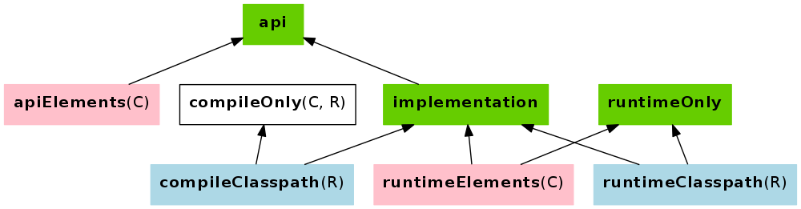

[background-color="#01303a"]
== Modelling the system

=== Java classpath

[%step]
* Input: jars or class directories
* Jar: class files
* Class file: both API and implementation

=== Compile classpath

What does the Java compiler cares about?

[%step]
* Accessible class names
* Accessible method signatures

=== Compile classpath

**Only accessible signatures matter**

=== Runtime classpath

What does the Java runtime cares about?

=== Runtime classpath

At runtime, *everything* matters, from classes to resources.

=== Compile avoidance

[%step]
* _compile_ and _runtime_ classpath have different _semantics_
* Gradle models the difference
* Ignores irrelevant (non ABI) changes to compile classpath

=== Icing on the cake

[%step]
* Upgrade a dependency from `1.0.1` to `1.0.2`
* If ABI hasn't changed, Gradle will _not_ recompile
* Even if the name of the jar is different (`mydep-1.0.1.jar` vs `mydep-1.0.2.jar`)
* Because only _contents_ matter

=== More modelling with dependencies configurations

[%step]
* `compile` and `runtime` were _only_ about _compilation_
* `api`, `implementation` and friends are about _compilation_ and _publication / consumption_

